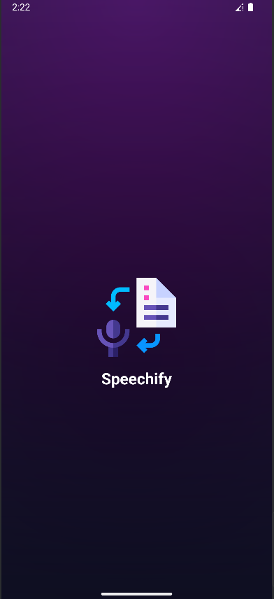
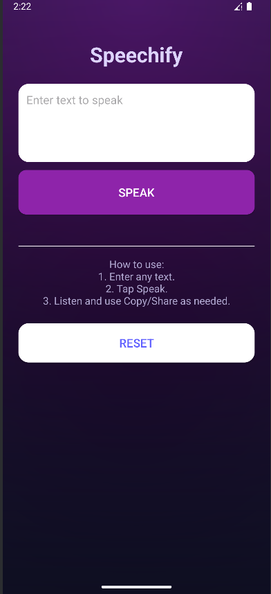
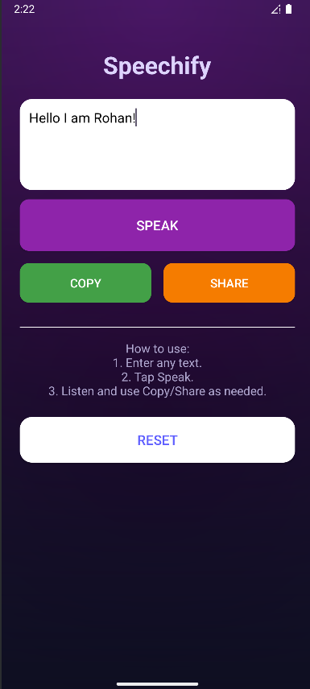

# Speechify

**Speechify** is a simple and powerful Text-to-Speech (TTS) Android application. Instantly convert any text into natural-sounding speech with a tap—perfect for reading articles, notes, or messages aloud. Copy and share your text easily, and enjoy a modern, user-friendly interface.

---

## Features

- 🎤 **Text to Speech:** Enter any text and have it read aloud instantly.
- 📋 **Copy & Share:** Easily copy your input or share it via other apps.
- 🧹 **Reset:** Clear your input and start over with a single tap.
- ☀️ **Modern UI:** Clean, touch-friendly design with clear instructions.
- 📴 **Offline:** Works without an internet connection (uses device TTS engine).

---

## Screenshots

<p float="left">
  
  
  
</p>

---

## How It Works

1. **Enter Text:** Type or paste any text into the input box.
2. **Tap "Speak":** The app reads the text aloud using your device’s TTS engine.
3. **Copy/Share (optional):** Use the Copy or Share buttons to use your text elsewhere.
4. **Reset:** Tap Reset to clear the input and hide Copy/Share buttons.

---

## Code Overview

### `activity_main.xml`
Defines a modern, scrollable UI:
- App title
- Large multi-line EditText for input
- "Speak" button
- Copy/Share buttons (hidden until used)
- Instructions and Reset button

### `MainActivity.java`
Handles all app logic:
- Initializes TTS engine
- Handles Speak, Copy, Share, and Reset actions
- Speaks text aloud using Android's TTS
- Shows/hides Copy and Share buttons as needed
- Manages TTS resources properly

<details>
<summary>Click to expand example Java logic</summary>

```java
TextToSpeech tts = new TextToSpeech(this, status -> {
    if (status != TextToSpeech.ERROR) {
        tts.setLanguage(Locale.getDefault());
    }
});

btnSpeak.setOnClickListener(v -> {
    String text = inputText.getText().toString().trim();
    if (TextUtils.isEmpty(text)) {
        Toast.makeText(this, "Please enter text to speak", Toast.LENGTH_SHORT).show();
        return;
    }
    tts.speak(text, TextToSpeech.QUEUE_FLUSH, null, null);
    btnCopy.setVisibility(View.VISIBLE);
    btnShare.setVisibility(View.VISIBLE);
});
```
</details>

---

## Getting Started

1. Clone this repository:
    ```bash
    git clone https://github.com/YOUR_USERNAME/YOUR_REPO_NAME.git
    ```
2. Open in Android Studio.
3. Build & run on your Android device.

---

## Requirements

- Android 5.0 (Lollipop) or higher
- Device with a Text-to-Speech engine (most Androids have this by default)

---

## License

This project is released under the [MIT License](LICENSE).

---

## Credits

- Designed and developed by [Your Name or Team]
- Uses Android’s built-in Text-to-Speech (TTS) engine

---

**Speechify — Turn any text into speech, instantly!**
